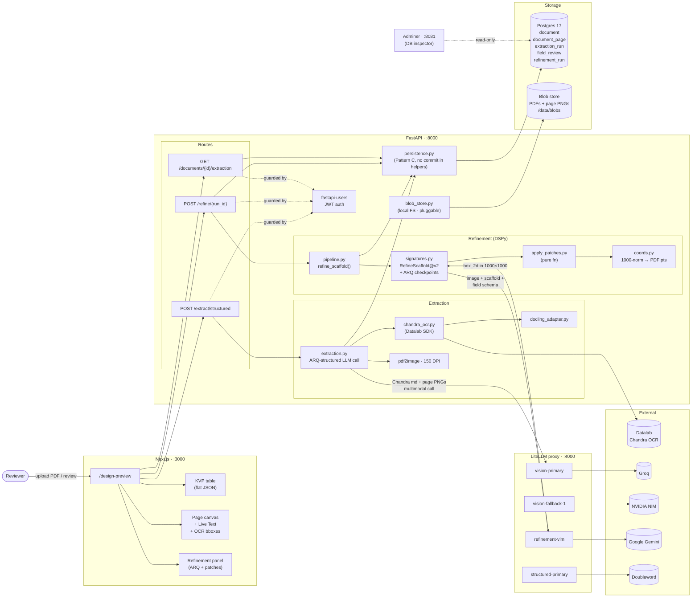
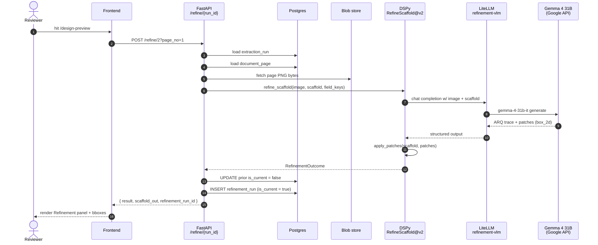
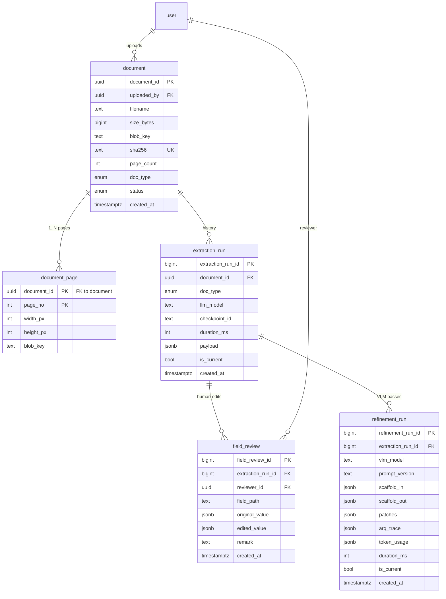

# Triple-H Architecture

End-to-end view of the document extraction + review system as it stands
on `feat/extraction-and-review`.

## System diagram



## How to read it

Three planes left-to-right:

1. **Frontend** — single `/design-preview` page renders three views over
   the same data: KVP fields, page canvas with Live Text + OCR bboxes,
   refinement panel showing ARQ trace and patches.
2. **Backend (FastAPI)** — Routes thin wrappers over two service
   subgraphs (Extraction, Refinement). `persistence.py` is the
   single-writer for domain tables. `blob_store.py` is pluggable.
3. **LiteLLM + External** — every model call funnels through LiteLLM
   virtual models. Provider swap is a `litellm/config.yaml` edit.

## Two main flows

### Extraction (cold path)

```
PDF
  → Chandra OCR (markdown + DoclingDocument scaffold)
  + pdf2image (page PNGs at 150 DPI)
  → multimodal LLM via vision-primary
  → typed extracted record (ARQ-structured)
  → persisted as extraction_run (immutable, append-only)
```

### Refinement (warm path, optional)

```
extraction_run
  → load DoclingDocument scaffold + page PNG
  → DSPy.RefineScaffold@v2 with three ARQ checkpoints
  → Gemma 4 31B emits patches (assign / reject / add / move) with box_2d
  → coords.py converts 1000-norm → PDF points
  → apply_patches builds scaffold_out
  → persisted as refinement_run (immutable, is_current flips)
```

## Refinement sequence diagram



## Database schema (relevant subset)



## Key invariants

- **`persistence.py` is the single writer** for domain tables. Routes
  never construct ORM objects directly; they call into helpers.
- **All LLM/VLM calls funnel through LiteLLM**. No direct provider
  SDK imports in business logic. Provider swap is one yaml edit.
- **Original artifacts preserved verbatim** — `scaffold_in`,
  `payload`, `original_value`. Patches/edits stored separately so
  any state can be replayed and reverted.
- **Pattern C append-only history**: every mutation table has
  `is_current` with a partial-unique constraint
  (`uq_*_one_current_per_*`). Demote prior row before inserting
  new one inside the same transaction.
- **Blob store is pluggable** (`BLOB_BACKEND=local|s3`). Same
  interface, S3 swap is a config flip.
- **DSPy Signatures are versioned** via `PROMPT_VERSION` constant
  persisted on every refinement_run row. Prompt drift is auditable.

## Service inventory (docker compose)

| Service | Port | Purpose |
|---------|------|---------|
| `frontend` | 3000 | Next.js dev server, `/design-preview` |
| `backend` | 8000 | FastAPI, async SQLAlchemy, fastapi-users |
| `litellm` | 4000 | OpenAI-compatible proxy fronting all providers |
| `db` | 5432 | Postgres 17 |
| `adminer` | 8081 | Browser DB inspector |
| `mailhog` | 1025 / 8025 | SMTP capture for fastapi-users emails |

## Repo layout (relevant subset)

```
fastapi_backend/
├── app/
│   ├── routes/
│   │   ├── extract.py        ← POST /extract/structured
│   │   ├── refine.py         ← POST /refine/{run_id}
│   │   └── documents.py      ← GET /documents/...
│   ├── services/
│   │   ├── chandra_ocr.py    ← Datalab SDK wrapper
│   │   ├── docling_adapter.py
│   │   ├── extraction.py     ← cold-path pipeline
│   │   ├── persistence.py    ← single writer
│   │   ├── blob_store.py     ← pluggable
│   │   └── extraction_overlay.py  ← read-side merge
│   ├── refinement/
│   │   ├── signatures.py     ← DSPy RefineScaffold@v2
│   │   ├── pipeline.py       ← refine_scaffold()
│   │   ├── apply_patches.py  ← pure fn
│   │   ├── coords.py         ← 1000-norm ↔ PDF pts
│   │   └── schemas.py        ← Pydantic types
│   ├── models.py             ← SQLAlchemy ORM
│   └── main.py
├── alembic_migrations/versions/
└── tests/
    ├── test_apply_patches.py
    └── ...

nextjs-frontend/
├── app/
│   ├── design-preview/
│   │   └── page.tsx          ← KVP + canvas + Live Text + Refine panel
│   ├── globals.css
│   └── layout.tsx
└── lib/fixtures/
    └── refinement-run-2.json ← live /refine response, swapped for
                                 fetch when GET endpoint lands

litellm/
└── config.yaml               ← virtual models + fallbacks

docker-compose.yml
mise.toml                     ← task runner entrypoint
```
