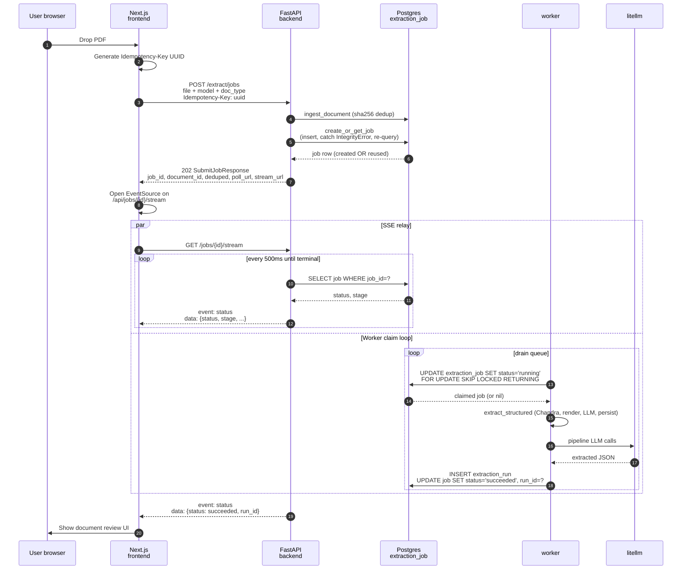

# Async job queue

The synchronous `/extract/structured` endpoint blocks for 30 to 200
seconds while the LLM works. To keep the upload UX responsive, every
modern upload path queues an `extraction_job` row in Postgres and
returns `202 + job_id` in ~200ms. A dedicated worker container picks
up jobs atomically, runs the pipeline, and writes results back. The
frontend learns about completion via either short polling or an SSE
stream.

## TL;DR

Postgres is the queue. Atomic claims use
`SELECT ... FOR UPDATE SKIP LOCKED ... RETURNING` so multiple worker
replicas never double-run a job (`fastapi_backend/app/services/job_queue.py:144-187`).
Dedup is two-layer: client-supplied `Idempotency-Key` plus a defensive
`(content_hash, model, doc_type)` partial unique index
(`fastapi_backend/app/models.py:479-507`). Stalled jobs (worker
crashed mid-pipeline) get requeued by a sweeper that fires every 60
seconds (`worker.py:203-217`).

## End-to-end flow



## Submit path: POST /extract/jobs

Route at `fastapi_backend/app/routes/jobs.py:104-224`. The handler:

1. Reads the multipart upload (`file`, `doc_type`, `model`, `dpi`).
2. Normalises `doc_type` against the four-value enum
   (`jobs.py:151-163`); empty/missing means auto-classify in the
   pipeline.
3. Reads the `Idempotency-Key` header
   (`jobs.py:121-132`). When the client omits one, the server
   generates a UUID — the `(content_hash, model, doc_type)` partial
   index still dedups identical re-uploads.
4. Calls `persistence.ingest_document` (idempotent on `sha256` — same
   bytes won't create a second `document` row).
5. Snapshots `document.document_id` and `document.sha256` *before*
   calling `create_or_get_job` because the dedup path inside
   `create_or_get_job` does `session.rollback()` which expires every
   ORM attribute (`jobs.py:188-195`).
6. Calls `job_queue.create_or_get_job` which attempts an INSERT and on
   `IntegrityError` looks up whichever active row beat us
   (`job_queue.py:53-103`, helper at `job_queue.py:106-136`).
7. Commits and returns 202 + a `SubmitJobResponse` containing
   `job_id`, `document_id`, `is_new_document`, `deduped`,
   current `status`, plus `poll_url` and `stream_url`.

Dedup precedence is tightest-first:

1. `idempotency_key` — `uq_extraction_job_idem_active` partial unique
   index on `(idempotency_key)` `WHERE status IN ('pending', 'running', 'succeeded')`
   (`models.py:478-483`).
2. `(content_hash, model, doc_type)` — two partial unique indexes
   (`uq_extraction_job_content_active_typed` and `..._auto`) split by
   `doc_type IS NULL` vs `NOT NULL` because Postgres requires
   IMMUTABLE expressions in index predicates and the implicit enum →
   text cast in COALESCE is STABLE (`models.py:488-507`).

## Worker: claim, process, write

`fastapi_backend/app/worker.py:186-228` runs two cooperating loops via
`asyncio.gather`.

### Claim loop

`_claim_loop` (`worker.py:186-200`):

```python
while not _shutdown.is_set():
    async with async_session_maker() as session:
        job = await job_queue.claim_next_pending(session)
        await session.commit()
    if job is None:
        await asyncio.wait_for(_shutdown.wait(), timeout=2.0)
        continue
    await _process_job(job)
```

`claim_next_pending` (`job_queue.py:144-187`) uses raw SQL because
SQLAlchemy has no clean helper for the `SKIP LOCKED` + UPDATE
RETURNING pattern:

```sql
WITH next_job AS (
    SELECT job_id FROM extraction_job
    WHERE status = 'pending'
    ORDER BY created_at
    FOR UPDATE SKIP LOCKED
    LIMIT 1
)
UPDATE extraction_job
SET status = 'running',
    started_at = NOW(),
    attempts = attempts + 1,
    locked_until = :lock_until
FROM next_job
WHERE extraction_job.job_id = next_job.job_id
RETURNING extraction_job.job_id
```

This is atomic and concurrent-safe: each pending row is taken by at
most one caller. `locked_until` is set to `NOW() + 600s`
(`DEFAULT_LEASE_SECONDS` at `job_queue.py:42`).

### Process

`_process_job` (`worker.py:77-183`):

1. Loads the `Document` row + raw PDF bytes from the blob store.
2. Transitions document status `uploaded`/`failed` → `processing`
   (preserves `extracted`/`reviewed` on retried runs).
3. Sets the job stage to `pipeline`, calls `extract_structured`.
4. Sets the job stage to `persist`, writes pages + extraction_run, and
   calls `job_queue.mark_succeeded(job_id, run_id)`.
5. On any exception, logs the traceback, calls `mark_failed` with a
   truncated error message, and flips document status to `failed`
   (only if it was `processing` — never downgrades a previously
   successful state).

`mark_succeeded` and `mark_failed` (`job_queue.py:210-262`) both gate
on `WHERE status = 'running'` — a stale worker that lost its lease
silently misses zero rows instead of clobbering a job another worker
has taken over.

### Sweeper loop

`_sweeper_loop` (`worker.py:203-217`) runs every
`SWEEPER_INTERVAL_S = 60.0`. Calls `job_queue.requeue_stalled`
(`job_queue.py:326-356`) which flips `running` jobs whose
`locked_until < NOW()` back to `pending`. Covers the case where a
worker crashed mid-pipeline before transitioning the job to a
terminal state.

## Status polling: GET /jobs/{job_id}

`jobs.py:294-304`. Simple `session.get(ExtractionJob, job_id)`
returning a `JobStatusResponse` projection. Intended for clients that
prefer a 1-2s polling loop over an open SSE connection. Also used by
the FE on initial page load before opening the stream.

The list variant `GET /jobs?limit&statuses` (`jobs.py:265-291`,
`job_queue.py:265-282`) is used by the FE queue panel to hydrate after
a page refresh — the worker's progress is persisted in DB rows so the
queue UI rebuilds from server state without client storage.

## SSE feed: GET /jobs/{job_id}/stream

Backend handler at `jobs.py:319-372`. A simple DB-poll loop (500ms
cadence) yields one frame whenever the `(status, stage)` tuple
changes. Closes on terminal states (`succeeded`, `failed`); hard cap
600s for keep-alive sanity. Why poll instead of `LISTEN/NOTIFY`? 500ms
lag is invisible to humans, the implementation is one screenful, and
it survives reloads cleanly (`jobs.py:333-335`).

### Frontend proxy

`nextjs-frontend/app/api/jobs/[id]/stream/route.ts:17-60`. Pipes the
backend's `text/event-stream` body straight through:

- `dynamic = "force-dynamic"` so the route isn't cached.
- `req.signal` forwarded to the upstream `fetch` so closing the browser
  tab tears down the backend poll loop instead of leaving it spinning.
- Headers set explicitly (`Cache-Control: no-cache, no-transform`,
  `X-Accel-Buffering: no`, `Connection: keep-alive`) so intermediate
  proxies and Next's own response handling don't buffer chunks.

The route exists because `API_BASE_URL` is server-only — there's no
`NEXT_PUBLIC_API_URL` for the browser to hit directly.

## Cancellation: POST /jobs/{job_id}/cancel

`jobs.py:378-406` calls `job_queue.cancel_job` (`job_queue.py:285-323`)
which flips `pending`/`running` → `failed` with
`error='cancelled by user'`. Idempotent — already-terminal jobs return
their current state with HTTP 200.

Caveat (documented in both files): the worker doesn't check this flag
mid-pipeline. A running job's pipeline continues to completion in the
worker, but `mark_succeeded` will silently miss zero rows (because the
status is no longer `running`), so the result is dropped. Wasted
compute but never overwrites the cancel. Co-operative mid-pipeline
cancellation is a follow-up — tracked in
[open-questions.md](../open-questions.md).

## Failure modes covered

| Scenario | Mitigation |
|----------|------------|
| Two browser tabs uploading the same PDF | `sha256` unique index on `document` + `(content_hash, model, doc_type)` partial unique on `extraction_job` |
| Client retries POST /extract/jobs after a network blip | `Idempotency-Key` header dedup returns the existing job |
| Two worker replicas claim concurrently | `FOR UPDATE SKIP LOCKED` ensures at most one wins |
| Worker dies mid-pipeline | `locked_until` lease expires; sweeper requeues after 60s |
| Stale worker writes after lease loss | `mark_succeeded`/`mark_failed` gated on `status='running'` |
| Cancel races worker completion | Worker silently no-ops; cancel state preserved |

## Cross-links

- What `extract_structured` actually does between claim and write:
  [extraction-pipeline.md](extraction-pipeline.md)
- Job table schema and indexes: [data-model.md](data-model.md)
- Tracing the queue with OTel + reading job spans:
  [observability.md](observability.md)
