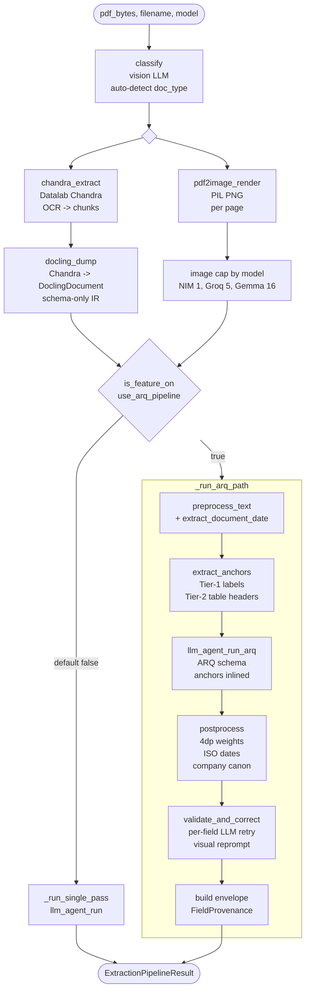

# Extraction pipeline

The pipeline turns a raw PDF into a typed JSON payload by chaining
Chandra OCR, Docling IR, a multimodal LLM call through LiteLLM, and
(on the two-stage branch) deterministic anchor extraction plus an
[ARQ-prompted](https://arxiv.org/abs/2503.03669) LLM call plus
self-correcting validators. There are two variants selected by the
GrowthBook flag `use_arq_pipeline`; both share Chandra + render and
only diverge at the LLM stage. The flag defaults off so a flag-server
outage routes through the proven single-pass path.

> **Terminology:** ARQ = **Attentive Reasoning Queries** (Karov, Zohar, Marcovitz, 2025 — [arXiv 2503.03669](https://arxiv.org/abs/2503.03669)). It is a Stage-2 prompting technique — *not* the same thing as the Stage-1 deterministic anchors. The flag name `use_arq_pipeline` informally covers the whole two-stage path. Unrelated to the Python `arq` job-queue library.

## TL;DR

`extract_structured(pdf_bytes, filename, model)` in
`fastapi_backend/app/services/extraction/pipeline.py:528` is the single
entrypoint. It classifies the document (if `doc_type` is None), kicks
Chandra OCR and PDF page rendering off in parallel, then reads
`is_feature_on("use_arq_pipeline", default=False)` once per request and
hands off to either `_run_single_pass` (line 656) or `_run_arq_path`
(line 686). Output is `ExtractionPipelineResult` — extracted dict,
markdown, docling doc, page PNGs, optional envelope for the ARQ path.

## Diagram

## Stage table

| Stage | Input | Output | File:line |
|-------|-------|--------|-----------|
| `classify` | PDF bytes + filename | `DocType` enum | `pipeline.py:557-558` (delegated to `architecture.classify`) |
| `chandra_extract` | PDF bytes | Chandra artifacts (markdown, chunks, DoclingDocument, checkpoint id) | `pipeline.py:572-577` |
| `pdf2image_render` | PDF bytes, DPI | `list[RenderedPage]` (PNGs + dimensions) | `pipeline.py:223-237`, `pipeline.py:579-585` |
| `docling_dump` | DoclingDocument | JSON-serializable dict | `pipeline.py:587-590` |
| `extract_anchors` (ARQ only) | Chandra blocks, doc_date | `list[FieldProvenance]` (Tier-1 label + Tier-2 table) | `anchors.py:184-218`, called from `pipeline.py:709-718` |
| `llm_agent_run` (single-pass) | schema, markdown, images | typed dict | `pipeline.py:677-682` |
| `llm_agent_run_arq` (ARQ) | ARQ schema, anchors inlined in prompt, markdown, images | typed dict (with `visual_audit` / `field_grounding` / `id_code_audit` reasoning slots) | `pipeline.py:288-347` |
| `postprocess` (ARQ only) | extracted dict, doc_type | normalized dict (4dp weights, ISO dates, optional company canon) | `postprocess.py:192-252`, called from `pipeline.py:730-739` |
| `validate_and_correct` (ARQ only) | extracted dict, page images, doc_type | corrected dict + `FieldCorrection[]` audit log | `correctors.py:249-384`, called from `pipeline.py:747-763` |

Every stage is wrapped in its own OpenTelemetry span — see
[observability.md](observability.md). The outer
`extract_structured` span carries `doc_type`, `model`, `dpi`,
`pipeline_variant`, and `page_count` attributes
(`pipeline.py:560-614`).

## Single-pass variant (default)

Schema-coerced extraction in one LLM call. Marker uses the
`DeliveryOrder` / `WeighingBill` / `Invoice` / `PetrolBill` plain
pydantic models from `tests_eval/schemas.py`. The prompt is built
inline at `pipeline.py:672-676` and the agent uses pydantic-ai's
`PromptedOutput` so the schema is embedded in the prompt rather than
sent as a provider-side tool spec. This avoids Groq's strict tool-call
validators rejecting shape mismatches the LLM would otherwise return
(see comment at `pipeline.py:154-157`).

Vision models receive the page PNGs capped by
`_image_cap_for(model)` (`pipeline.py:99-106`); text-only models
receive markdown only and the corrector loop is skipped because it
needs the visual to be useful.

No envelope is produced — `ExtractionPipelineResult.envelope` stays
`None` and the route falls back to the flat `extracted` dict.

## ARQ variant

When `use_arq_pipeline` is on, `_run_arq_path` adds four deterministic
stages around the LLM call:

1. **preprocess_text** — OCR repair (`pipeline.py:704-707`); also
   extracts a document date used to anchor character correction.
2. **extract_anchors** — Tier-1 + Tier-2 regex anchoring (below).
3. **llm_agent_run_arq** — uses a per-doc-type ARQ wrapper schema with
   three leading reasoning slots before the typed `extracted` field
   (`arq.py:135-181`). Anchors are inlined into the prompt with
   `_format_anchors_for_prompt` (`pipeline.py:243-265`) and the model
   is told to confirm them verbatim.
4. **postprocess** — `postprocess_extracted` enforces 4dp weights, ISO
   `YYYY-MM-DD` dates, and (when a registry is supplied) fuzzy company
   canonicalization (`postprocess.py:46-145`).
5. **validate_and_correct** — `correct_invalid_fields` walks every
   registered (doc_type, field) pair, validates with a typed validator
   (Malaysian plate, LHDN TIN, ISO/MY date, MY postcode), and on
   failure issues a focused one-field correction call to the LLM with
   the page image (`correctors.py:249-384`). Per-run budget defaults to
   2 concurrent corrections so latency stays bounded.
6. **build envelope** — `_build_envelope` (`pipeline.py:439-525`)
   assembles `ExtractionEnvelope` with per-field provenance: anchor
   rows from extraction, plus synthetic `vlm`-source rows for every
   populated field that no anchor fired on. Top-level scalars and
   `items[i].<key>` cells alike get exactly one provenance row.

### ARQ schemas

**ARQ** = **Attentive Reasoning Queries** (Karov, Zohar, Marcovitz, 2025 — [arXiv 2503.03669](https://arxiv.org/abs/2503.03669)). A structured-prompting technique: the model fills an ordered sequence of typed reasoning slots before emitting the final answer, so reasoning is inspectable and reproducible. The deterministic anchors from `extract_anchors` are *inputs* to the ARQ prompt, not part of the ARQ technique itself.

Each doc-type has a `*ARQ` wrapper in
`fastapi_backend/app/services/extraction/arq.py`:

- `DeliveryOrderARQ` — `arq.py:135-148`
- `WeighingBillARQ` — `arq.py:151-159`
- `InvoiceARQ` — `arq.py:162-170`
- `PetrolBillARQ` — `arq.py:173-181`

All four share the same three leading `str` slots — `visual_audit`,
`field_grounding`, `id_code_audit` — before the typed `extracted`
payload. Field declaration order is load-bearing: pydantic-ai's
`PromptedOutput` respects it and autoregressive decoders complete in
order, so the reasoning slots are filled and attended to immediately
before the schema-coerced output. The dispatcher
`ARQ_BY_DOC_TYPE` lives at `arq.py:186-191`.

The three slot purposes (paraphrased from `arq.py:13-43`):

- **visual_audit** — enumerate five concrete page cues without
  consulting OCR; counters the scaffold-bias failure mode where the
  model trusts OCR even when the image disagrees.
- **field_grounding** — for each schema field, either locate the
  visual region or mark `NOT PRESENT`; pre-validated anchors confirmed
  verbatim; shape-only candidates accepted or rejected with one-line
  evidence.
- **id_code_audit** — flag OCR-ambiguous characters (S/5, l/1, O/0,
  B/8, Z/2, G/6) in reference codes. Flag only — the actual
  substitution runs deterministically in `preprocess.correct_id_chars`
  once the value has a date anchor.

## Tier-1 vs Tier-2 anchoring

Both passes produce `FieldProvenance` records with
`confidence=1.0`; their tier is recorded in `source` so downstream
consumers can prefer one over the other.

### Tier 1: `regex_label` (label proximity)

`_scan_label_block` at `anchors.py:230-261`. For each block's plain
text, scan for known label phrases (e.g. `r"vehicle\s*(?:no|number|plate)"`,
`r"d\s*[./]?\s*o\s*(?:no|number)"`, `r"tarikh"` for MY date) and
within an 80-character lookahead window apply a per-field value regex.
Label hints live at `anchors.py:59-100`; value patterns at
`anchors.py:122-142`. Vehicle plates are validated against regional
patterns (peninsular, Sabah, Sarawak); ID-code candidates get OCR
character correction (`correct_id_chars` with the document date).

### Tier 2: `regex_table` (table headers)

`_scan_table_block` at `anchors.py:300-347`. For each `<table>` block,
parse the HTML, map `<th>` headers to schema fields by phrase
membership (`_HEADER_HINTS` at `anchors.py:161-178`), then iterate
rows and extract each cell whose column maps to a field. Includes
nested item-row fields (`items.description`, `items.quantity`,
`items.unit_price`, `items.amount`, `items.weight_mt`). When the table
has no `<th>` row, falls back to using the first `<tr>`'s `<td>` cells
as headers (`anchors.py:357-365`).

### Tier 3: `shape_only` (not emitted)

Documented at `anchors.py:21-29` but intentionally not produced —
false-positive rate is too high without label/header context. The
plan is to let the LLM accept/reject low-confidence candidates
directly via the `field_grounding` slot.

### Deduplication

`_dedupe_anchors` at `pipeline.py:268-285` collapses duplicate
`(field, value)` pairs, keeping the first occurrence. Common case:
weighing bills with both labelled blocks and a values table both fire
on the same value.

### Items expansion

`_expand_item_anchors` (`pipeline.py:350-403`) converts schema-key
form (`items.description`) emitted by `extract_anchors` to FE-flattened
form (`items[0].description`) so the review UI's path convention
matches. Each anchor is bound to the first matching row by string
value; duplicates with the same value (e.g. two rows with quantity
"2") consume row slots in order via a `claimed` set so they don't
collapse onto row 0.

## Open weights only

The LLM provider list is fixed by `litellm/config.yaml:25-100`:

- `ollama-gemma4-31b` — primary, Ollama Cloud Gemma 4 31B, vision.
- `gemma-4-31b` — Google AI Studio fallback for the same model.
- `groq-llama4-scout` / `groq-llama4-maverick` — Groq Llama 4 vision,
  fast, 5 images per request cap.
- `nim-llama-90b-vision` — NVIDIA NIM Llama 3.2 90B, single image only.
- `doubleword-qwen3.5` — text-only schema-enforced.
- `groq-llama-3.3-70b` — text-only chat fallback.

Pipeline branches twice on `_is_vision_model` (`pipeline.py:176-185`):
whether to render and attach images, and whether the corrector loop
runs at all. Image caps are per-model (`pipeline.py:89-106`) so a
misconfiguration never blasts past a provider hard limit.

## Cross-links

- Flag wiring + safe defaults: [observability.md](observability.md)
- How the worker invokes this pipeline from a queued job:
  [async-job-queue.md](async-job-queue.md)
- Persistence of the result (extraction_run.payload shape):
  [data-model.md](data-model.md)
- ADRs covering the chunked Chandra approach, ARQ rationale, and
  open-weights policy: [decisions/](../decisions/)
