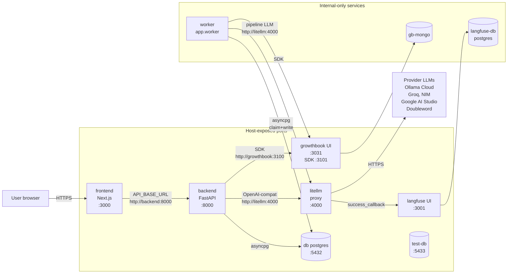

# System overview

Triple-H is a PDF-to-structured-data extraction service for Heng Hup
logistics paperwork (delivery orders, weighing bills, invoices, petrol
bills). The stack is a FastAPI backend plus a dedicated worker process,
a Next.js frontend, Postgres, a LiteLLM proxy, and an observability
triad (OpenTelemetry, Langfuse, GrowthBook). All inter-service traffic
stays inside one docker-compose network; only a handful of host ports
are exposed for human-facing UIs and dev access.

## TL;DR

A user uploads a PDF in the Next.js frontend, which POSTs to the
FastAPI backend at `/extract/jobs`. The backend persists the document,
queues a row in `extraction_job`, and returns `202 + job_id`. A separate
worker container claims the job from Postgres (`FOR UPDATE SKIP LOCKED`),
runs the Chandra-OCR-then-LLM pipeline (single-pass by default, ARQ
when the GrowthBook flag flips), writes results into `extraction_run`,
and the frontend either polls or holds an SSE connection to learn that
the job finished.

## Container topology

## Per-service purpose

### `backend` (FastAPI, port 8000)

Public HTTP surface. Owns: user/auth (fastapi-users), upload + ingest
(`/extract/jobs`, `/extract/structured`), document review CRUD
(`/documents/*`), job status (`/jobs/{id}`, `/jobs/{id}/stream`), and
refinement (`/refine/*`). Auto-instruments FastAPI + httpx + asyncpg via
OpenTelemetry. Builds and starts identically to `worker` (same image,
different entrypoint).

See [extraction-pipeline.md](extraction-pipeline.md) for what `/extract/structured` runs
synchronously, and [async-job-queue.md](async-job-queue.md) for `/extract/jobs`.

### `worker` (FastAPI image, `python -m app.worker`)

Headless consumer of the `extraction_job` table. Two cooperating
asyncio loops: a claim loop that grabs one job at a time via
`FOR UPDATE SKIP LOCKED`, and a sweeper loop that requeues jobs whose
lease (`locked_until`) expired without completion. Horizontally
scalable — the claim is atomic, so multiple replicas never double-run a
job. Defined in `fastapi_backend/app/worker.py:186-228`.

### `db` (Postgres 17, port 5432)

Single source of truth for documents, pages, extraction runs, field
reviews, refinements, and the job queue. ORM lives in
`fastapi_backend/app/models.py`; full schema in
[data-model.md](data-model.md). Uses partial unique indexes (one-current-per-document,
one-active-job-per-idempotency-key) so business invariants are enforced
at the storage layer rather than only at the service layer.

### `test-db` (Postgres 17, port 5433, `test` profile)

Ephemeral mirror of `db` for the auth-integration test suite. No
volume — every container restart starts clean. Tests run
`Base.metadata.create_all` then `drop_all` per function.

### `litellm` (proxy, port 4000)

Unified OpenAI-compatible endpoint for every LLM call the backend
makes. Routes by virtual model name (`ollama-gemma4-31b`,
`groq-llama4-scout`, `gemma-4-31b`, `groq-llama4-maverick`,
`nim-llama-90b-vision`, `doubleword-qwen3.5`, `groq-llama-3.3-70b`)
declared in `litellm/config.yaml:25-100`. Handles retries, fallbacks,
and the per-provider quirks (Groq's 8192 token cap, NIM's 1-image
limit, Ollama Cloud thinking-disable). Open-weights-only policy — no
Gemini, no GPT, no Claude. Fires the Langfuse `success_callback` on
every call.

### `frontend` (Next.js App Router, port 3000)

Upload dropzone + extraction queue panel + document review UI. Uses
TanStack Query for state, an OpenAPI-generated client for type-safe
backend calls, and consumes SSE for live job status. Proxies the SSE
stream through `app/api/jobs/[id]/stream/route.ts` because
`API_BASE_URL` is server-only (no `NEXT_PUBLIC` prefix).

### `langfuse` + `langfuse-db` (UI port 3001)

LLM-call observability. LiteLLM forwards every call (prompt, response,
tokens, cost, latency) to Langfuse via the `success_callback`. Empty
keys at first boot disable the callback gracefully — see the bootstrap
in `CLAUDE.md:54-65`. UI runs at `http://localhost:3001`. Pinned to
`langfuse/langfuse:2` (single web container + dedicated Postgres);
upgrade to v3 if ingestion volume needs ClickHouse.

### `growthbook` + `gb-mongo` (UI port 3031, SDK port 3101)

Feature flag service. Host ports deliberately offset from the upstream
defaults (3030/3100) to avoid colliding with a separate GrowthBook
instance on some dev machines. Backend reaches the SDK over the docker
network at `http://growthbook:3100`. The only active flag right now is
`use_arq_pipeline`, gating the two-stage ARQ extraction variant —
default off means an SDK outage routes traffic through the proven
single-pass code path. Bootstrap steps in `CLAUDE.md:75-87`.

## Where to look next

- Pipeline internals and the flag-gated ARQ branch: [extraction-pipeline.md](extraction-pipeline.md)
- Queue mechanics, idempotency, SSE flow: [async-job-queue.md](async-job-queue.md)
- Table-by-table schema and Alembic migration history: [data-model.md](data-model.md)
- Bootstrapping the observability triad and reading its UIs: [observability.md](observability.md)

For history and decisions, see [history/timeline.md](../history/timeline.md)
and the ADR index at [decisions/](../decisions/). Open follow-ups live
in [open-questions.md](../open-questions.md).
