# Build timeline: 118 commits across 6 phases

This repository's history spans **Mar 25, 2026 → May 13, 2026** — roughly seven weeks of work on the `feat/arq-extraction` branch. The sole maintainer is DarrenSJZ (~114 commits, 97%); three additional commits come from Sean Yee. There are **zero tags** — every commit is treated as live, no formal release boundaries have been cut.

The phases below are not git branches. They are a reading of the commit log grouped by what the repo was actually doing at each window of time. Phase boundaries are intent shifts, not merge commits.

```mermaid
timeline
    title triple-h build journey
    section Phase 0 Fork cleanup
        Mar 25 : 5e30153 consolidate doc_extractor remove dead code
        Mar 25 : 29bac9f rename hh-app to frontend
        Mar 30 : 5e2b267 reset frontend bun biome
        Mar 30 : 6825744 docker setup move deps to pyproject
        Mar 30 : ddeea82 switch to dotenvx
    section Phase 1 Extraction core
        Apr 14 : f9a7e5d rebuild on nextjs-fastapi-template
        Apr 19 : b89cad8 typed eval schemas per doc-type
        May 06 : 43071fc LLM provider layer Chandra extract endpoint
        May 06 : 0ce3b06 LiteLLM proxy
        May 06 : 8f89ce8 multimodal extract structured endpoint
        May 07 : 2164877 rewrite around Datalab SDK plus DoclingDocument IR
        May 07 : 5284c2f Pattern C persistence
        May 07 : b171125 VLM refinement DSPy plus Gemma Phase 1
    section Phase 2 Frontend convergence
        May 07 : ff7cf5b Heng Hup brand foundation
        May 07 : c96e07a drop auth dashboard design-preview cruft
        May 07 : ba2c5e9 document review UI with layered overlay
        May 08 : 2046d9a tabs vertical-fit overlay model selector
        May 08 : eaafc15 merge PR 1 extraction and review
    section Phase 3 Async pipeline
        May 11 : 39d4796 extraction_job table
        May 11 : 08129f9 postgres-backed job queue with idempotency
        May 11 : 59e9a47 POST extract jobs plus SSE stream
        May 11 : e42fd05 extraction queue worker container
        May 11 : 7e62d57 multi-file staging plus live jobs panel
    section Phase 4 Observability bootstrap
        May 10 : cf01ef0 Langfuse plus GrowthBook stacks
        May 10 : b434609 OpenTelemetry traces plus GrowthBook SDK init
        May 10 : 733c84c drop chandra probes plus broken tracer
    section Phase 5 ARQ migration
        May 09 : 1d8a217 deterministic stage 1 foundation
        May 09 : cd1f021 tier-1 tier-2 anchors plus per-doc-type ARQ schemas
        May 10 : 9f6e3d3 T9 wire ARQ two-stage path behind GrowthBook flag
        May 10 : e8ce670 items i anchor expansion plus self-correction loop
        May 12 : 5f01512 unify upload dropzone single morphing container
```

---

## Phase 0: Fork cleanup (Mar 25 – Apr 14, 2026)

The first 23 commits. The job here was deletion, infrastructure, and getting a fresh skeleton that two humans could agree to build on.

> The largest commit in the repo's history sits inside this phase: `f9a7e5d Rebuild on nextjs-fastapi-template with eval infrastructure` (215 files / +41433 / -5893). It is the load-bearing reset that everything else descends from.

- `5e30153` — Clean fork: consolidate doc_extractor, remove dead code (Mar 25, 134 files / +22391)
- `29bac9f` — Rename hh-app to frontend (Mar 25)
- `ff12ec4` — Add dev tooling: mise, ruff, mypy, pre-commit (Mar 30)
- `5e2b267` — Reset frontend: bun, biome, clean Next.js structure (Mar 30, -20953)
- `6825744` — Add Docker setup, move deps from requirements.txt to pyproject.toml (Mar 30)
- `ddeea82` — Switch to dotenvx for env management (Mar 30)
- `5433b22` — Add env encryption check, split mise setup tasks, fix Docker dotenvx (Mar 31)
- `c5a3758` — Add mise encrypt/decrypt tasks for dotenvx (Mar 31)
- `336e767` — Add mise docker tasks (docker, docker:build, docker:down) (Mar 31)
- `6d2291b` — removed .env example (Mar 31)
- `c7f947c` — Add mise postinstall hook and use dotenvx for docker tasks (Apr 4)
- `22be192` — Re-encrypt .env with new dotenvx keypair (Apr 4)
- `ab9b5d5` — Refactor Docker setup: multi-stage builds, remove in-container dotenvx (Apr 4)
- `7fea843` — Exclude proposal, .env.keys, and .claude from Docker context (Apr 4)
- `df023b3` — Migrate from deprecated google-generativeai to google-genai (Apr 4)
- `62f8561` — Add pricing proposal slides for Heng Hup Holdings (Apr 4)
- `b6b8259` — Add paddle-models volume, docker:reset and docker:prune tasks (Apr 5)
- `10b3b1c` — Switch defaults to gemini-2.5-flash and PaddleOCR, single source of truth (Apr 5)
- `f1a2c7a` — Pin paddlepaddle <3.3.0 to fix CPU inference PIR bug (Apr 5)
- `491f372` — Update pricing slides: setup timeline, 24-month at RM 5K, postpaid overage (Apr 5)
- `f9a7e5d` — Rebuild on nextjs-fastapi-template with eval infrastructure (Apr 14, +41433 / -5893)
- `a36fd9a` — Switch frontend to bun + biome, unify dotenvx with shared .env.keys (Apr 14)
- `973c15b` — Consolidate to single root .gitignore, track frontend .env (Apr 14)

By the end of Phase 0, the repo had: mise as the task runner, dotenvx for encrypted envs, multi-stage Dockerfiles, the nextjs-fastapi-template skeleton, and the eval-test scaffold for ground-truth-based evaluation. None of the extraction logic existed yet.

---

## Phase 1: Extraction core (Apr 19 – May 7, 2026)

Where the product actually started working. ~24 commits, dense weekends. Built the LLM provider layer, then the LiteLLM proxy, then the multimodal endpoint, then rewrote the whole pipeline around DoclingDocument as the canonical IR.

The sub-themes inside this phase:

### Eval schemas (Apr 19)

- `b89cad8` — feat: add typed eval schemas for per-doc-type ground truth
- `1a002fa` — feat: migrate ground truth to pydantic-evals YAML datasets
- `eb37daf` — refactor: rewire eval tests to load typed YAML datasets

### Env hygiene (May 5–6)

- `e8dfc0f` — feat: add pre-commit hook to verify .env files encrypted
- `a2fe389` — fix: use python3 in env-encrypted hook to bypass pyenv-win shim
- `e8d5e5c` — chore(docker): fix dev stack with HMR and auto-migrate

### LLM stack lands (May 6)

- `f445271` — feat(backend): add deps for extraction pipeline
- `43071fc` — feat(backend): LLM provider layer + Chandra OCR /extract endpoint
- `0ce3b06` — feat(infra): add LiteLLM proxy for multi-provider LLM routing
- `8f89ce8` — feat(backend): multimodal /extract/structured endpoint via LiteLLM

### Pipeline rewrite (May 7)

> `2164877 feat(backend): rewrite extraction pipeline around Datalab SDK + DoclingDocument IR` is the second load-bearing commit of the project (after the origin reset). It cut the backend image from 4.68GB to 1.84GB by dropping `docling`/`torch`/`torchvision`, replaced the hand-rolled httpx Chandra client with the Datalab SDK, and established `DoclingDocument` as the canonical IR for downstream consumers.

- `2164877` — feat(backend): rewrite extraction pipeline around Datalab SDK + DoclingDocument IR
- `4793fa6` — docs: add project CLAUDE.md — mise as default, trace harness usage
- `6c4dc85` — chore(skills): gitignore local skill installs, track lock manifest

### Persistence (May 7)

- `5284c2f` — feat(backend): persist documents, pages, and extraction runs (Pattern C)
- `244ce01` — feat(backend): add extraction_overlay helper for field_review merge
- `d5cfb62` — chore(dev): trace harness for stage-by-stage extraction inspection

### DSPy + Gemma refinement experiment (May 7)

The refinement layer was built as an additive Phase-2 stage that could enhance Stage-1 LLM output with VLM-grounded bbox corrections. It still survives in the backend tree even though the FE overlay was later dropped.

- `b171125` — feat(backend): VLM refinement layer (DSPy + Gemma) — Phase 1
- `2e6ab58` — fix(refine): DSPy 3.x async-task scoping + correct image API + Gemma 4
- `e4cecc3` — feat(refine): Phase 2 — bbox grounding via Gemma 4 native box_2d
- `c25f83a` — chore(infra): add Adminer DB inspector at :8081

### Backend cleanup (May 7)

- `dc1e250` — docs(arch): add docs/architecture.md with mermaid diagrams
- `ec0db3b` — fix(docs): mermaid ER PK_FK is not valid syntax
- `aa89f5d` — chore(backend): remove legacy /items skeleton CRUD
- `b024893` — chore(docker): drop mailhog service
- `88bcc36` — chore(docker): drop adminer service
- `629d7ca` — chore(backend): remove dead langchain-era files
- `4ba1d83` — refactor(backend): introduce DoclingArchitecture as pluggable extractor
- `e458dbe` — feat(backend): per-request timing middleware
- `608c24d` — feat(backend): auto-classify doc + auth-free API
- `1e80c6e` — feat(backend): per-page block overlay + field anchor heuristic

By the end of Phase 1, the backend could: accept a PDF, run Chandra OCR via the Datalab SDK, build a DoclingDocument IR, render page images, and have a multimodal LLM emit typed JSON via pydantic-ai. Eval harness was wired. Persistence (documents, pages, extraction_runs) was live. DSPy + Gemma refinement existed but was not yet user-visible.

---

## Phase 2: Frontend convergence (May 7 – May 8, 2026)

~13 commits. The Next.js shell had been carrying auth, dashboard, and design-preview surfaces since the `f9a7e5d` rebuild. Phase 2 ripped them all out, replaced them with a single document-review surface, and painted on the Heng Hup brand identity.

### Brand + design-preview sandbox (May 7)

- `ff7cf5b` — feat(frontend): Heng Hup brand identity + bento warehouse foundation
- `48e17c5` — feat(frontend): Live Text sandbox at /design-preview (Phase A)
- `4d052f0` — refactor(frontend): greybox wireframe + JSON KVP fields + Live Text fix
- `5de8029` — feat(frontend): VLM Refinement panel in design-preview
- `a36d0d7` — feat(frontend): render Gemma 4 add-op bboxes on the page canvas

### VLM overlay walked back (May 7)

> The bbox overlay on the FE canvas (`a36d0d7`) was reverted in `4af3a70` — a 94-line straight delete. The bbox-on-canvas UX didn't justify its complexity; a tabular field-level review was preferred. **Backend DSPy refinement infrastructure was not removed** — it still lives in `app/refinement/`. Only the canvas overlay went.

- `4af3a70` — refactor(frontend): drop VLM bbox overlay from canvas
- `515a31c` — docs(claude): require explicit confirmation before commits/pushes
- `8cdfcfd` — chore(gitignore): exclude trace harness output dir

### Auth rip-out and review UI (May 7)

- `723b694` — chore(frontend): regen openapi client + raise server action body cap
- `c96e07a` — chore(frontend): drop auth/dashboard/design-preview cruft (24 files / -2459)
- `1a94689` — feat(frontend): Heng Hup brand identity
- `ba2c5e9` — feat(frontend): document review UI with layered overlay
- `ace23ca` — feat(review): per-page KVP filter via field anchors

### Polish + first merge (May 8)

- `2046d9a` — feat(review): tabs, vertical-fit overlay, model selector, re-extract
- `b9e2aec` — feat(frontend): zoom/pan, upload progress, documents pagination
- `266c72b` — feat(review): ctrl+wheel zoom inside PDF viewer
- `a6d8ef0` — feat(frontend): add Heng Hup favicon
- `4dbb580` — feat(frontend): swap favicon png -> svg
- `5ff004e` — feat(docs): delete documents and audit log entries; tighter favicon
- `f22b8b3` — fix(review): resolve Radix Tabs hydration mismatch under React 19
- `eaafc15` — Merge pull request #1 from DJS-Projects/feat/extraction-and-review

The merge `eaafc15` closes Phase 2. From this point onward, the frontend is single-purpose: upload, extract, review.

---

## Phase 3 (early): Type-safety + CI runway (May 9, 2026)

A short bridge phase of ~7 commits between the first merge and the ARQ work. The codebase was tightened up so the next wave of changes could be reviewed safely.

- `07ce983` — fix(types): pass mypy strict on app/
- `20b189b` — fix(types): adopt basedpyright in standard mode
- `491d652` — chore(deps): bump ruff pin to match pre-commit hook
- `29c8c99` — chore(tests): silence two upstream deprecation warnings
- `5d8a027` — chore(test): auto-manage ephemeral test Postgres for be:test
- `c0383e7` — add node to mise tools for wsl environments
- `1f6abc4` — Merge pull request #2 from DJS-Projects/feat/extraction-and-review

(`323df53 ci: add GitHub Actions workflow for backend + frontend`, May 9, slots here too — wired up the CI lane that would gate every subsequent change.)

---

## Phase 5 begins early: ARQ deterministic foundation (May 9, 2026)

The ARQ migration started on May 9 — slightly *before* the observability stack landed. Listing it here for chronological honesty; the heavier ARQ work resumes in Phase 5 (below) after observability is in place.

> `1d8a217 feat(extraction): deterministic stage 1 foundation` (+1509 lines) is the third load-bearing commit of the project. It introduces the ARQ skeleton — a deterministic, schema-driven Stage 1 that runs *before* any LLM call, anchoring the LLM's output to verifiable substrings extracted from the DoclingDocument IR.

- `1d8a217` — feat(extraction): deterministic stage 1 foundation
- `cd1f021` — feat(extraction): tier-1/tier-2 anchors + per-doc-type ARQ schemas
- `3b79eb3` — chore(extraction): annotate arq.py field helpers as -> Any
- `d9dba21` — feat(extraction): postprocess — 4dp weights, ISO dates, fuzzy company match
- `323df53` — ci: add GitHub Actions workflow for backend + frontend

---

## Phase 4: Observability bootstrap (May 10, 2026)

~10 commits in a single day. The observability stack was wired in deliberately, in a specific order: secret management → Ollama Cloud path → Langfuse + GrowthBook compose services → OpenTelemetry traces + GrowthBook SDK init → docs → dead-probe cleanup → ARQ gated behind GrowthBook flag.

### Secret + infra prep

- `24110cd` — chore(infra): add mise env:addkey helper for encrypted secret paste
- `7add06f` — feat(infra): use Ollama Cloud as primary Gemma 4 path

### Observability services

- `cf01ef0` — infra(observability): add Langfuse + GrowthBook stacks to docker-compose
- `b434609` — feat(observability): OpenTelemetry traces + GrowthBook SDK init
- `640fa85` — docs(claude): bootstrap steps for Langfuse + OTel + GrowthBook

### Dead-probe cleanup

> `733c84c chore: drop unused chandra probes + broken stage tracer` (-690 lines) removed four scratch scripts that pre-dated OpenTelemetry. The probes were one-off Datalab SDK exploration; the stage tracer had already broken because the extraction package refactor moved symbols it depended on. OTel manual spans now provide stage timing.

- `733c84c` — chore: drop unused chandra probes + broken stage tracer

### ARQ gated behind a flag

- `9f6e3d3` — feat(extraction): T9 — wire ARQ two-stage path behind GrowthBook flag
- `f9017fc` — chore(docker): move growthbook to ports 3031/3101 to avoid candor collision
- `0c31ce3` — chore(test): teardown ephemeral test-db on be:test exit
- `47ea061` — infra(growthbook): allow LAN/Tailscale host overrides + add SDK key
- `0bae03c` — chore(mise): add docker:rebuild task + warn against raw docker build

By the end of Phase 4, the backend had OpenTelemetry auto-instrumentation on FastAPI/httpx/asyncpg, manual spans on each pipeline stage, Langfuse callback wired into LiteLLM, and a GrowthBook feature flag (`use_arq_pipeline`) gating the deterministic Stage-1 path against the legacy single-pass.

---

## Phase 5: ARQ migration + async pipeline + FE polish (May 10 – May 13, 2026 — current)

The largest active phase. ~25 commits covering: deeper ARQ work (anchor expansion, self-correction, postprocess), the postgres-backed job queue with SSE streaming, the worker container, and an iteration arc on the FE upload + jobs UX.

### Deeper ARQ (May 10)

- `e8ce670` — feat(extraction): items[i] anchor expansion + self-correction loop + envelope-derived page/anchor maps (+1473)
- `4f617ff` — feat(extraction): parallelize self-correction loop
- `8f0fd2e` — chore(env): add Langfuse keys

### Pipeline knobs (May 11)

- `a8e5f9f` — feat(litellm): disable model thinking for latency A/B
- `a023136` — feat(pipeline): per-model image cap registry

### Postgres-backed async queue (May 11)

> `08129f9 feat(queue): postgres-backed job queue with idempotency` (+717 lines) chose Postgres-as-queue over a separate broker (Redis/RabbitMQ/SQS). The decision keeps the deployment surface to one moving piece — the same database that already holds Documents, Pages, and ExtractionRuns. Idempotency is enforced at the SQL level.

- `39d4796` — feat(db): extraction_job table for async queue
- `08129f9` — feat(queue): postgres-backed job queue with idempotency
- `59e9a47` — feat(api): POST /extract/jobs + SSE status stream
- `e42fd05` — feat(infra): extraction queue worker container
- `3da0300` — fix(routes/jobs): snapshot Document attrs before queue call
- `af15ed4` — feat(queue): cancel + list-recent endpoints
- `573b4aa` — feat(worker): transition document.status during job lifecycle

### FE catches up to the async backend (May 11)

- `602a6d5` — chore(fe): regenerate openapi client for jobs endpoints
- `6a7d0c1` — feat(fe): SSE + cancel proxy routes for /api/jobs/[id]
- `238fc71` — feat(fe): server actions for the async job queue
- `7e62d57` — feat(fe): multi-file staging + live jobs panel + status icons
- `e942a9b` — feat(fe): jobs panel select mode + state icons + bulk dismiss
- `fcf88bd` — feat(fe): dismissible info card for the model note
- `3f7ec23` — chore(fe): drop em-dash placeholder when doc_type is null

### Upload UX iteration (May 12)

- `2fe1a8c` — feat(fe): extract recent uploads list + persist dismiss state
- `5f01512` — feat(fe): unify upload dropzone into single morphing container

### Where we are now

As of May 13, 2026, the live state of `feat/arq-extraction` is:

- **Backend** — FastAPI + SQLAlchemy + Alembic on Postgres. Chandra OCR via Datalab SDK; DoclingDocument as canonical IR. LiteLLM proxy fronts every LLM call. ARQ deterministic Stage 1 is wired behind GrowthBook flag `use_arq_pipeline` (default off); when on, the pipeline runs anchor extraction + a parallelized self-correction loop before the final LLM call. Self-correction is parallelized. Postprocess normalizes weights to 4dp, dates to ISO, and resolves company names via fuzzy match.
- **Async** — `POST /extract/jobs` enqueues an `extraction_job` row; the dedicated worker container picks it up; an SSE stream pipes status transitions back to the FE.
- **Frontend** — single-page review surface, no auth. Multi-file staging, live jobs panel with selectable batch dismiss, page viewer with zoom/pan, model selector, re-extract. Upload dropzone unified into a morphing container that holds its page position across empty/staged states.
- **Observability** — OpenTelemetry traces (stdout when no OTLP endpoint), Langfuse for LLM-level traces via the LiteLLM `success_callback`, GrowthBook for feature flagging. All stacks boot empty-keyed; manual bootstrap per `CLAUDE.md`.
- **Refinement** — DSPy + Gemma layer still exists in `app/refinement/` but the FE no longer renders its bbox output on the page canvas. Path-of-record for now, not deleted.

There are zero tags and no formal release boundary. The next inflection is when ARQ flips on by default; the GrowthBook gate exists precisely so that can happen without a code change.
